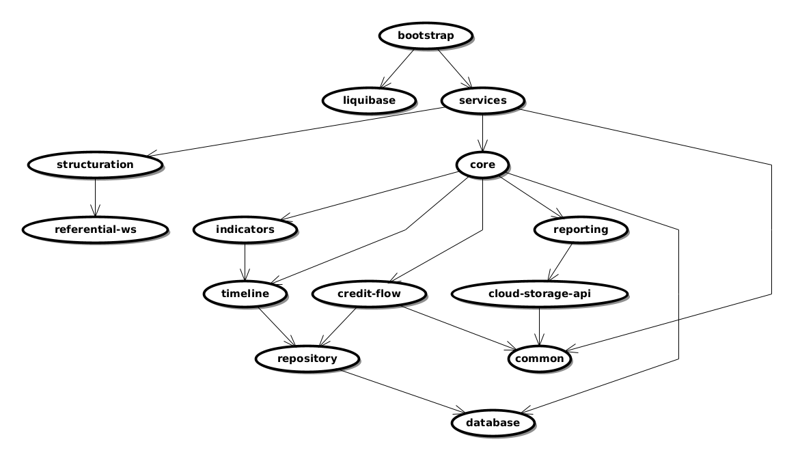

[](https://github.com/cafetux/dot-diagram-to-picture/actions/workflows/maven.yml)

# A very basic DOT renderer to PNG for java

DOT: graph description language
https://en.wikipedia.org/wiki/DOT_%28graph_description_language%29

Custom basic DOT diagram parser.

Image renderer and graph organisation (to easy lisible graph) made with diagramming from mindfusion:
https://www.mindfusion.eu/java-diagram.html

Exemple of generated picture:


Usage: 

```java
    Path path = resourceDirectory.resolve("some-dependency-diagram.gv");
    FlowChart result = new DotDiagramParser().parse(path);
    new ImageRenderer().render(result,"target/result");
```
